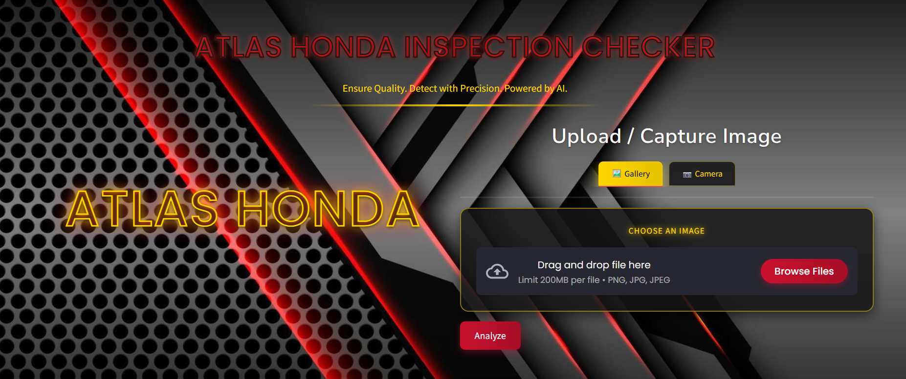
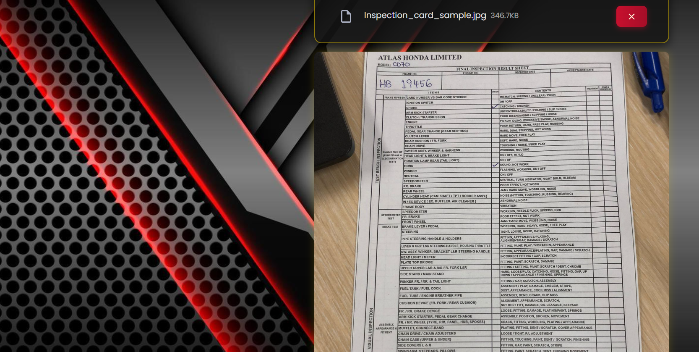
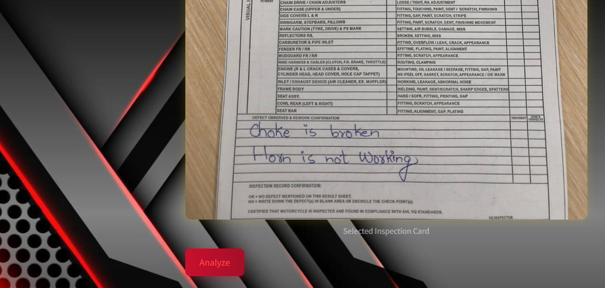
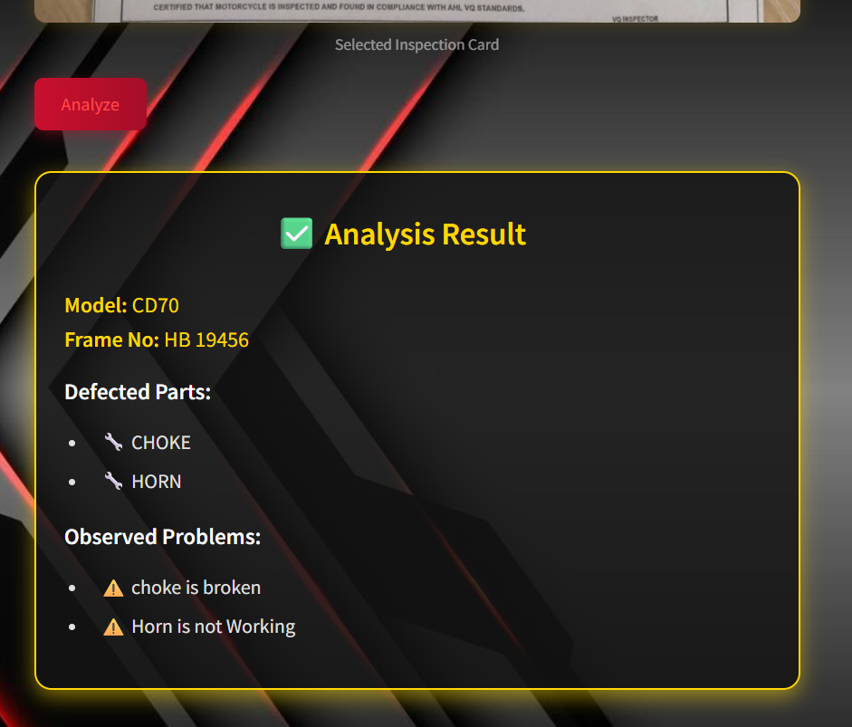

# Atlas Honda Inspection Checker

An AI-powered inspection sheet analyzer for Atlas Honda bikes.  
Upload or capture a photo of an inspection card, and the app automatically extracts:  
- **Bike model**  
- **Frame number**  
- **Defected part names** (based on tick marks)  
- **Defects observed** from the handwritten confirmation section  

This project uses **Google Gemini (via LangChain)** and **Streamlit** to create a sleek, interactive web application.

---

## 🚀 Features
- 📷 **Upload or capture** inspection card images  
- 🤖 **AI-powered OCR** using Google Gemini  
- 🛠️ Extracts structured inspection data  
- 🎨 **Custom Streamlit UI** with animations and branding  
- ⚡ Real-time analysis with formatted results  

---

## 🛠️ Tech Stack
- **Python 3.10+**
- [Streamlit](https://streamlit.io/)
- [LangChain](https://www.langchain.com/)
- [Google Gemini AI](https://ai.google.dev/)
- [dotenv](https://pypi.org/project/python-dotenv/)


---

## ⚙️ Installation & Setup

### 1️⃣ Clone the repository
```bash
git clone https://github.com/Arsalan692/Atlas-Honda-Inspection-Checker
cd Atlas-Honda-Inspection-Checker
```

### 2️⃣ Create a virtual environment (optional but recommended)
```bash
python -m venv venv
source venv/bin/activate   # For Linux/Mac
venv\Scripts\activate      # For Windows
```

### 3️⃣ Install dependencies
```bash
pip install -r requirements.txt
```
### 4️⃣ Set up API key
**🔑 Setting Up Google Gemini API Key**
- Go to Google AI Studio: https://aistudio.google.com
- Sign in with your Google Account.
- Click Get API Key from the sidebar.
- Create a new API key and copy it.

### 5️⃣ Add API Key
**Create a .env file in the project root and add your keys:**
```bash
# GOOGLE API KEY
GOOGLE_API_KEY=your_api_key_here
```

### 6️⃣ Run the app
```bash
streamlit run Metal_OCR_detection.py
```
---

## 📸 Demo Screenshots
<p align="center">
  
  
  
  
</p>


